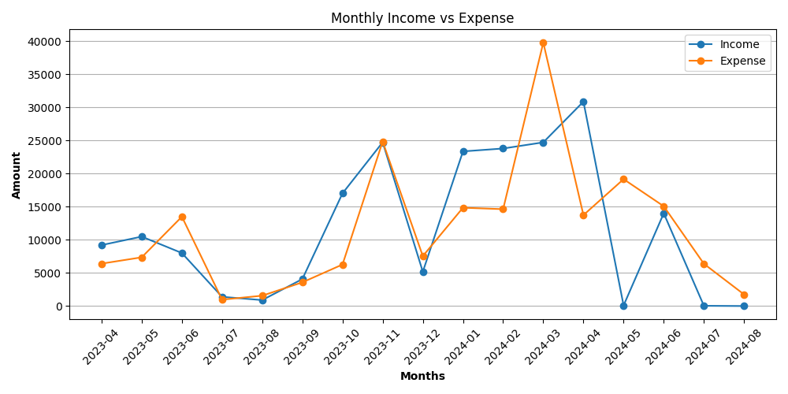
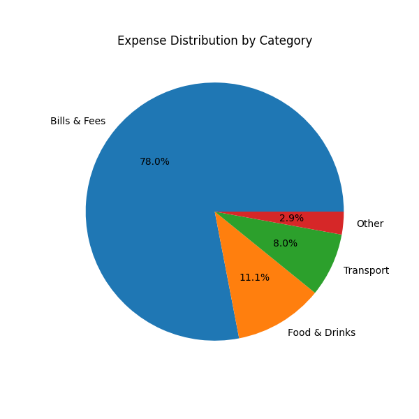

# 📊 Personal Finance Analysis using Python

## 🔹 Project Overview

This project analyzes personal financial transactions to understand income, expenses, savings patterns, and spending behavior.  
The objective is to extract meaningful insights from real-world financial data using Python.

---

## 🔹 Dataset Description

The dataset contains financial transactions with the following key columns:

- **Date** – Transaction date  
- **Title** – Description of the transaction  
- **Category** – Expense or income category  
- **Account** – Account used for the transaction  
- **Amount** – Transaction value  
- **Type** – INCOME, EXPENSE, TRANSFER  

**Note:**  
Transfer transactions were excluded from calculations to avoid double counting, as transfers do not affect net financial position.

---

## 🔹 Tools & Libraries Used

- **Python** – Programming language
- **NumPy** – Numerical calculations  
- **Pandas** – Data cleaning and analysis  
- **Matplotlib** – Data visualization  

---

## 🔹 Data Cleaning & Preparation

The following preprocessing steps were performed:

- Converted date column to datetime format  
- Removed commas from amount values and converted them to numeric  
- Handled missing values in categorical columns  
- Removed irrelevant columns with excessive missing data  
- Separated transactions into income, expense, and transfer  

---

## 🔹 Analysis Performed

- Total income, total expense, and net savings calculation  
- Monthly income vs expense comparison  
- Category-wise expense distribution  
- Account-wise expense analysis  

---

## 📈 Visualizations

### 🔹 Monthly Income vs Expense

This line chart shows how income and expenses change over time and helps identify overspending months.

---

### 🔹 Category-wise Expense Distribution

This pie chart highlights how total expenses are distributed across different categories.

---

### 🔹 Account-wise Expense Analysis

This bar chart compares spending across different accounts such as cash and bank accounts.

---

## 🔹 Key Insights

- Total income and total expense analysis
- Expenses are concentrated in a few major categories  
- Monthly trends reveal patterns in spending and saving  
- Certain accounts are used more frequently for expenses  
- Income vs expense comparison helps understand savings behavior  

---

## 🔹 Conclusion

This project demonstrates practical data analysis skills by working with real personal finance data.  
It shows how Python can be used to clean data, perform financial analysis, and visualize insights to improve financial decision-making.

---
