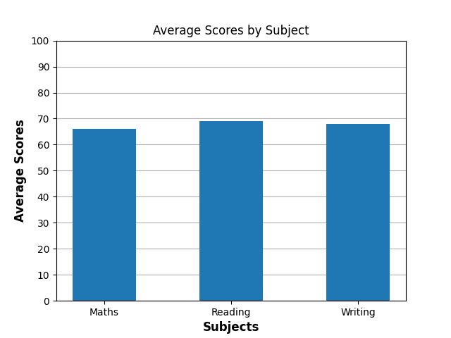
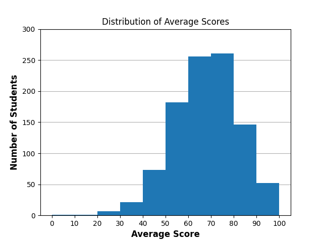

# 📊 Student Performance Analysis using Python

## 📌 Project Overview

This project analyzes student performance data to understand how students score across subjects and how different factors affect their overall performance.

The analysis is done using **Python**, focusing on data analysis and visualization using real-world datasets.

---

## 📂 Dataset

The dataset contains information about students, including:

- Gender
- Parental level of education
- Lunch type
- Test preparation course
- Math score
- Reading score
- Writing score

A new feature called **average_score** is created to represent each student’s overall performance.

---

## 🛠 Tools & Libraries Used

- **Python**
- **Pandas** – data loading, cleaning, and analysis
- **NumPy** – numerical calculations
- **Matplotlib** – data visualization

---

## 🔍 Steps Performed

### 1. Data Understanding

- Loaded the dataset
- Checked shape, columns, and data types
- Verified missing values
- Reviewed summary statistics

### 2. Feature Engineering

- Created a new column:
  - **average_score** = average of math, reading, and writing scores

### 3. Data Analysis

- Identified low-performing students
- Analyzed the impact of test preparation on performance
- Calculated subject-wise average scores
- Computed overall average score

---

## 📊 Data Visualizations

### 📈 Average Score by Subject

This graph compares the average scores of students across Math, Reading, and Writing.

---

### 📈 Impact of Test Preparation on Performance

This graph shows how test preparation affects students’ average scores.

---

### 📈 Distribution of Average Scores

This histogram shows how students’ average scores are distributed across different ranges.

---

## 📈 Key Insights

- Students who completed the test preparation course scored higher on average.
- Math has the lowest average score among all subjects.
- Most students have an average score between **60 and 80**.
- Very few students fall in extremely low or extremely high score ranges.
- Overall student performance is moderate.

---

## 🧠 What I Learned

- How to explore and clean real-world datasets
- When to use Pandas and NumPy
- How to create meaningful visualizations
- How to control histogram bins and axis ticks
- How to explain insights clearly from data

---

## 📌 Conclusion

This project demonstrates a complete data analysis workflow:
data loading → cleaning → analysis → visualization → insights.

It strengthened my fundamentals in Python data analysis and prepared me for more complex datasets.

---

## 🚀 Future Improvements

- Add analysis based on gender and lunch type
- Save and automate report generation
- Apply the same workflow to larger datasets like sales data

---
