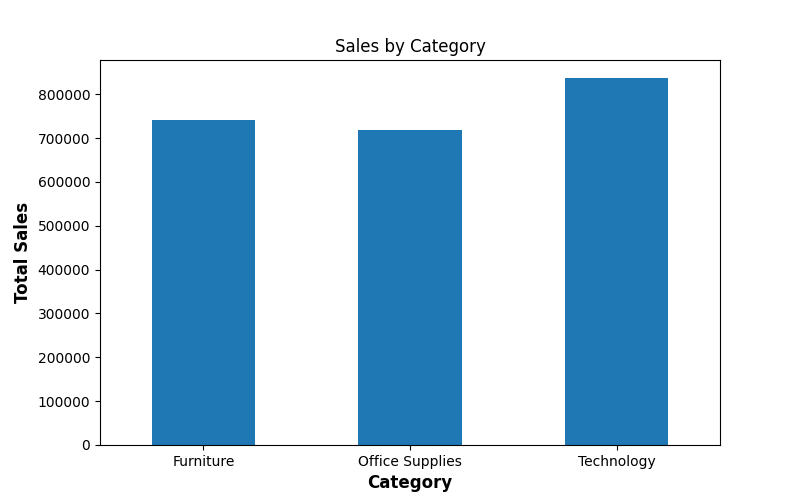
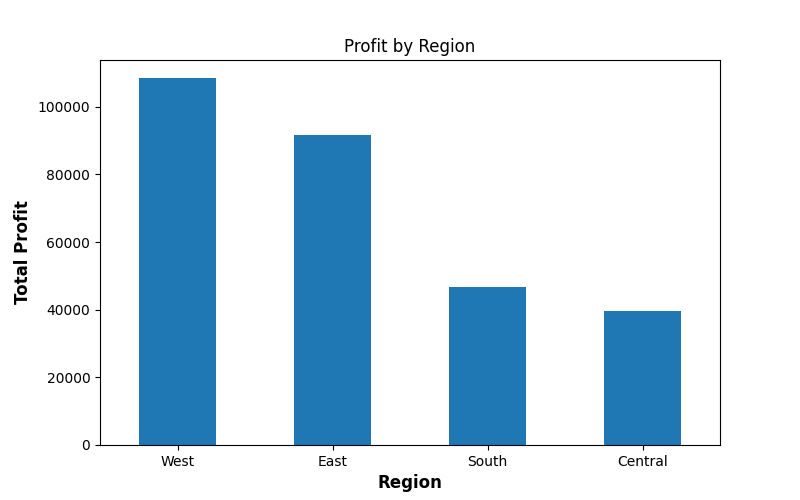
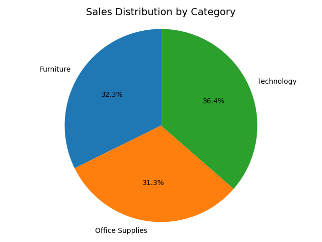

# 📊 Superstore Sales Data Analysis (Python)

## 📌 Project Overview

This project analyzes a real-world retail dataset to understand **sales trends, category performance, and regional profitability**.  
The objective is to extract **meaningful business insights** using Python data analysis and visualization.

---

## 🎯 Objective

- Analyze overall sales and profit
- Identify top-performing categories and regions
- Study monthly sales trends
- Visualize insights using appropriate charts

---

## 📂 Dataset

- **Name:** Sample Superstore Dataset  
- **Source:** Kaggle  
- **Size:** 9,994 rows × 21 columns  

---

## 🛠 Tools & Libraries Used

- Python  
- NumPy  
- Pandas  
- Matplotlib  

---

## 🔎 Analysis Performed

- Converted date columns to datetime format
- Verified missing values and duplicates
- Calculated total and average sales and profit
- Category-wise and region-wise analysis
- Monthly sales trend analysis
- Percentage contribution using pie chart

---

## 📈 Visualizations

### 1️⃣ Monthly Sales Trend

Shows how sales change over time and highlights seasonal patterns.

---

### 2️⃣ Sales by Category

Compares total sales across different product categories.

---

### 3️⃣ Profit by Region

Identifies which region contributes the most profit.

---

### 4️⃣ Sales Share by Category

Displays percentage contribution of each category to total sales.

---

## 💡 Key Business Insights

- **Furniture** generates the highest sales volume but lower profit compared to Technology  
- **Technology** is the most profitable category overall  
- The **West region** contributes the highest profit  
- Monthly sales show noticeable fluctuations, indicating seasonal demand  
- A small number of products drive a large portion of total sales  

---

## 🧠 Learnings from This Project

- Handling and cleaning real-world datasets
- Choosing the correct visualization for different data types
- Controlling axes, ticks, and layout in Matplotlib
- Converting analysis into business insights

---

## 📌 Conclusion

This project demonstrates practical skills in **data cleaning, analysis, and visualization** using Python.  
It reflects how data analysis is performed in real business scenarios.
